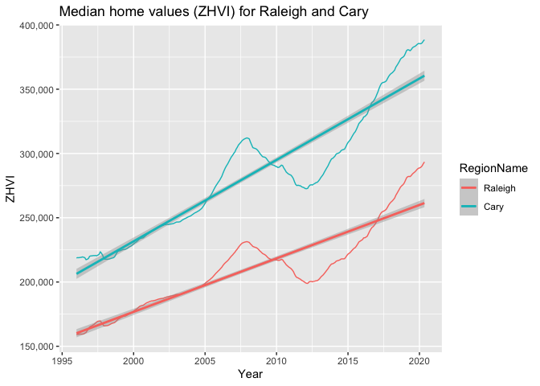

Raleigh Real Estate
================
Elsita Kiekebusch
7/17/2020

Zillow Home Value Index
-----------------------

Comparing home values across various cities in the Raleigh NC area. I used data made available by Zillow at \#<https://www.zillow.com/research/data/> This data estimates the value of US homes using Zillow's Home Value Index (ZHVI) estimated from 1996 to 2020, and available at several location levels (eg State, City, zip code) and representing several types of homes (eg. single family residences, condos).

More info about ZHVI here: \#<https://www.zillow.com/research/why-zillow-home-value-index-better-17742/> "The one-sentence explanation is that Zillow takes all estimated home values for a given region and month (Zestimates), takes a median of these values, applies some adjustments to account for seasonality or errors in individual home estimates, and then does the same across all months over the past 20 years and for many different geography levels (ZIP, neighborhood, city, county, metro, state, and country)."

Packages
--------

``` r
#packages needed
library(knitr)
knitr::opts_chunk$set(echo = TRUE)
library(readr)
library(dplyr)
library(tidyr)
library(ggplot2)
library(scales)
```

First Exploration of Data
-------------------------

Here I download the dataset representing the 'middle' market tier, where the ZHVI was extracted for homes falling in between the 35th and 65th percentile of houses. In other words these values are the median (50th percentile) for the entire dataset (more at: <https://www.zillow.com/research/zhvi-methodology-2019-deep-26226/>).

This dataset includes all homes (single family residences, condos and coops together). I extract data for the state of North Carolina, and then filter for the Raleigh and Durham-Chapel Hill Metro areas. I then select several regions within those areas for further comparison.

``` r
setwd('~/Documents/Job Search/Data Science/projects/Raleigh_RealEstate')
all_homes_city <- read_csv("City_zhvi_uc_sfrcondo_tier_0.33_0.67_sm_sa_mon.csv") 
head(all_homes_city)
```

    ## # A tibble: 6 x 301
    ##   RegionID SizeRank RegionName RegionType StateName State Metro CountyName
    ##      <dbl>    <dbl> <chr>      <chr>      <chr>     <chr> <chr> <chr>     
    ## 1     6181        0 New York   City       NY        NY    New … Queens Co…
    ## 2    12447        1 Los Angel… City       CA        CA    Los … Los Angel…
    ## 3    39051        2 Houston    City       TX        TX    Hous… Harris Co…
    ## 4    17426        3 Chicago    City       IL        IL    Chic… Cook Coun…
    ## 5     6915        4 San Anton… City       TX        TX    San … Bexar Cou…
    ## 6    13271        5 Philadelp… City       PA        PA    Phil… Philadelp…
    ## # … with 293 more variables: `1996-01-31` <dbl>, `1996-02-29` <dbl>,
    ## #   `1996-03-31` <dbl>, `1996-04-30` <dbl>, `1996-05-31` <dbl>,
    ## #   `1996-06-30` <dbl>, `1996-07-31` <dbl>, `1996-08-31` <dbl>,
    ## #   `1996-09-30` <dbl>, `1996-10-31` <dbl>, `1996-11-30` <dbl>,
    ## #   `1996-12-31` <dbl>, `1997-01-31` <dbl>, `1997-02-28` <dbl>,
    ## #   `1997-03-31` <dbl>, `1997-04-30` <dbl>, `1997-05-31` <dbl>,
    ## #   `1997-06-30` <dbl>, `1997-07-31` <dbl>, `1997-08-31` <dbl>,
    ## #   `1997-09-30` <dbl>, `1997-10-31` <dbl>, `1997-11-30` <dbl>,
    ## #   `1997-12-31` <dbl>, `1998-01-31` <dbl>, `1998-02-28` <dbl>,
    ## #   `1998-03-31` <dbl>, `1998-04-30` <dbl>, `1998-05-31` <dbl>,
    ## #   `1998-06-30` <dbl>, `1998-07-31` <dbl>, `1998-08-31` <dbl>,
    ## #   `1998-09-30` <dbl>, `1998-10-31` <dbl>, `1998-11-30` <dbl>,
    ## #   `1998-12-31` <dbl>, `1999-01-31` <dbl>, `1999-02-28` <dbl>,
    ## #   `1999-03-31` <dbl>, `1999-04-30` <dbl>, `1999-05-31` <dbl>,
    ## #   `1999-06-30` <dbl>, `1999-07-31` <dbl>, `1999-08-31` <dbl>,
    ## #   `1999-09-30` <dbl>, `1999-10-31` <dbl>, `1999-11-30` <dbl>,
    ## #   `1999-12-31` <dbl>, `2000-01-31` <dbl>, `2000-02-29` <dbl>,
    ## #   `2000-03-31` <dbl>, `2000-04-30` <dbl>, `2000-05-31` <dbl>,
    ## #   `2000-06-30` <dbl>, `2000-07-31` <dbl>, `2000-08-31` <dbl>,
    ## #   `2000-09-30` <dbl>, `2000-10-31` <dbl>, `2000-11-30` <dbl>,
    ## #   `2000-12-31` <dbl>, `2001-01-31` <dbl>, `2001-02-28` <dbl>,
    ## #   `2001-03-31` <dbl>, `2001-04-30` <dbl>, `2001-05-31` <dbl>,
    ## #   `2001-06-30` <dbl>, `2001-07-31` <dbl>, `2001-08-31` <dbl>,
    ## #   `2001-09-30` <dbl>, `2001-10-31` <dbl>, `2001-11-30` <dbl>,
    ## #   `2001-12-31` <dbl>, `2002-01-31` <dbl>, `2002-02-28` <dbl>,
    ## #   `2002-03-31` <dbl>, `2002-04-30` <dbl>, `2002-05-31` <dbl>,
    ## #   `2002-06-30` <dbl>, `2002-07-31` <dbl>, `2002-08-31` <dbl>,
    ## #   `2002-09-30` <dbl>, `2002-10-31` <dbl>, `2002-11-30` <dbl>,
    ## #   `2002-12-31` <dbl>, `2003-01-31` <dbl>, `2003-02-28` <dbl>,
    ## #   `2003-03-31` <dbl>, `2003-04-30` <dbl>, `2003-05-31` <dbl>,
    ## #   `2003-06-30` <dbl>, `2003-07-31` <dbl>, `2003-08-31` <dbl>,
    ## #   `2003-09-30` <dbl>, `2003-10-31` <dbl>, `2003-11-30` <dbl>,
    ## #   `2003-12-31` <dbl>, `2004-01-31` <dbl>, `2004-02-29` <dbl>,
    ## #   `2004-03-31` <dbl>, `2004-04-30` <dbl>, …

``` r
#str(all_homes_city)

all_nc_city <- all_homes_city %>% filter(State == "NC")
#str(all_nc_city)

dates_only <- all_nc_city[,c(9:301)]
concise_nc <- all_nc_city %>% select(RegionName, Metro)
concise_nc <- cbind(concise_nc,dates_only)
```

Looking at the geographic regions in the Raleigh area, and then in the Chapel-Hill Durham area.

``` r
#look at what is within raleigh, and durham-chapel hill
raleigh_towns <- concise_nc %>%
  filter(Metro == "Raleigh")
unique(raleigh_towns$RegionName)
```

    ##  [1] "Raleigh"         "Cary"            "Apex"           
    ##  [4] "Wake Forest"     "Clayton"         "Garner"         
    ##  [7] "Fuquay Varina"   "Holly Springs"   "Morrisville"    
    ## [10] "Knightdale"      "Zebulon"         "Smithfield"     
    ## [13] "Wendell"         "Willow Spring"   "Benson"         
    ## [16] "Franklinton"     "Youngsville"     "Four Oaks"      
    ## [19] "Princeton"       "Kenly"           "Rolesville"     
    ## [22] "New Hill"        "Selma"           "Bunn"           
    ## [25] "Micro"           "Wilsons Mills"   "West Smithfield"
    ## [28] "Louisburg"       "Centerville"     "Pine Level"

``` r
dch_towns <- concise_nc %>%
  filter(Metro == "Durham-Chapel Hill")
unique(dch_towns$RegionName)
```

    ##  [1] "Durham"       "Chapel Hill"  "Roxboro"      "Hillsborough"
    ##  [5] "Pittsboro"    "Siler City"   "Carrboro"     "Rougemont"   
    ##  [9] "Bahama"       "Timberlake"   "Hurdle Mills" "Efland"      
    ## [13] "Bear Creek"   "Moncure"      "Goldston"     "Cedar Grove" 
    ## [17] "Semora"       "Bennett"      "Gulf"         "Bonlee"

Here I select the specific regions that I am interested in, prioritizing some of the regions in/near RTP (that is, between the bigger cities of Raleigh, Durham and Chapel Hill) and a few areas of interest south of Raleigh as well.

``` r
tri_cities <- concise_nc %>% 
  filter(RegionName == "Raleigh" | RegionName == "Cary" | RegionName == "Morrisville" | RegionName == "Holly Springs" | RegionName == "Apex" | RegionName == "Garner" | RegionName == 
           "Durham" | RegionName == "Chapel Hill" | RegionName == "Carrboro") 
#head(tri_cities)
```

I need to tidy up the dataset so that the dates are no longer the column names, but rather an important feature for further use. I gather the data into long form and can then visualize.

``` r
#ok getting the dates in shape for ggplot
tri_long <- tri_cities %>% 
  gather("Date", "ZHVI", -RegionName, -Metro)
str(tri_long)
```

    ## 'data.frame':    2637 obs. of  4 variables:
    ##  $ RegionName: chr  "Raleigh" "Durham" "Cary" "Chapel Hill" ...
    ##  $ Metro     : chr  "Raleigh" "Durham-Chapel Hill" "Raleigh" "Durham-Chapel Hill" ...
    ##  $ Date      : chr  "1996-01-31" "1996-01-31" "1996-01-31" "1996-01-31" ...
    ##  $ ZHVI      : num  158921 137107 218719 NA 217990 ...

``` r
tri_long$Date <- as.Date(tri_long$Date)
str(tri_long)
```

    ## 'data.frame':    2637 obs. of  4 variables:
    ##  $ RegionName: chr  "Raleigh" "Durham" "Cary" "Chapel Hill" ...
    ##  $ Metro     : chr  "Raleigh" "Durham-Chapel Hill" "Raleigh" "Durham-Chapel Hill" ...
    ##  $ Date      : Date, format: "1996-01-31" "1996-01-31" ...
    ##  $ ZHVI      : num  158921 137107 218719 NA 217990 ...

``` r
ggplot(tri_long, aes(x=Date, y=ZHVI, color = RegionName)) +
  geom_line() +
  facet_wrap(~Metro) +
  scale_y_continuous(labels = comma)
```

    ## Warning: Removed 74 row(s) containing missing values (geom_path).


Looks like Chapel Hill is the region with the highest median home values over the entire period. At first glance, looks like for all regions there is strong increase (appreciation) in home value, and this trend seems to become stronger after the 2008 housing crisis (which can also be seen as the dip in values).

Raleigh Area Home Values
------------------------

Now I want to focus more on several specific areas near Raleigh / RTP. I highlighted these above but now I will extract them for further use. I create a single dataset that encompasses all these areas, and that combines some of the different types of housing datasets available from zillow.

Note: Bottom Tier Value covers the 5th-35th percentile of home values, Top Tier covers the 65th-95th percentile of home values.

``` r
#all homes in Raleigh 
all_homes <- raleigh_towns %>% 
  filter(RegionName == "Raleigh" | RegionName == "Cary" | RegionName == "Morrisville" | RegionName == "Holly Springs" | RegionName == "Apex" | RegionName == "Garner") 
all_homes$Metro <- NULL #dont need this anymore
all_homes$Type <- "All Homes"

#all single family residences
sfr_city <- read_csv("City_zhvi_uc_sfr_tier_0.33_0.67_sm_sa_mon.csv")
sfr_city$Type <- "Single Family Residence"

#all condos and coops
condos_city <- read_csv("City_zhvi_uc_condo_tier_0.33_0.67_sm_sa_mon.csv")
condos_city$Type <- "Condos"

#four bedroom houses
four_bdrm_city <- read_csv("City_zhvi_bdrmcnt_4_uc_sfrcondo_tier_0.33_0.67_sm_sa_mon.csv")
four_bdrm_city$Type <- "Four Bedroom House"

#top tier (65th-95th percentile housing value)
#csv name suggests it is 67-100 percentile
top_tier_city <- read_csv("City_zhvi_uc_sfrcondo_tier_0.67_1.0_sm_sa_mon.csv")
top_tier_city$Type <- "Top Tier Value"

#bottom tier (5th-35th percentile housing value)
#csv name suggests it is 0-33 percentile
bot_tier_city <- read_csv("City_zhvi_uc_sfrcondo_tier_0.0_0.33_sm_sa_mon.csv")
bot_tier_city$Type <- "Bottom Tier Value"

#put them together! 
most_data <- rbind(sfr_city, condos_city, four_bdrm_city, top_tier_city, bot_tier_city)

#get data for NC, get dates, city names and the type of data
most_nc_data <- most_data %>% filter(State == "NC")
dates <- most_nc_data[,c(9:301)]
concise_nc_data <- most_nc_data %>% select(RegionName, Type)
most_concise_nc <- cbind(concise_nc_data, dates)

# get cities of interest
#i think faster to get cities of interest in first step before gathering
most_raleigh_cities <- most_concise_nc %>%
  filter(RegionName == "Raleigh" | RegionName == "Cary" | RegionName == "Morrisville" | RegionName == "Holly Springs" | RegionName == "Apex" | RegionName == "Garner")

all_raleigh_cities <- rbind(all_homes, most_raleigh_cities)
#quick check
unique(all_raleigh_cities$RegionName)
```

    ## [1] "Raleigh"       "Cary"          "Apex"          "Garner"       
    ## [5] "Holly Springs" "Morrisville"

``` r
unique(all_raleigh_cities$Type)
```

    ## [1] "All Homes"               "Single Family Residence"
    ## [3] "Condos"                  "Four Bedroom House"     
    ## [5] "Top Tier Value"          "Bottom Tier Value"

``` r
#gather eg make long form
all_raleigh_long <- all_raleigh_cities %>% 
  gather("Date", "ZHVI", -Type, -RegionName) %>%
  arrange(Type, RegionName) #organize

all_raleigh_long$Date <- as.Date(all_raleigh_long$Date)

#set order of facets in advance
all_raleigh_long$Type <- factor(all_raleigh_long$Type, levels = c("Single Family Residence", "Condos", "Four Bedroom House", "Bottom Tier Value", "All Homes", "Top Tier Value"))
str(all_raleigh_long)
```

    ## 'data.frame':    10548 obs. of  4 variables:
    ##  $ RegionName: chr  "Apex" "Apex" "Apex" "Apex" ...
    ##  $ Type      : Factor w/ 6 levels "Single Family Residence",..: 5 5 5 5 5 5 5 5 5 5 ...
    ##  $ Date      : Date, format: "1996-01-31" "1996-02-29" ...
    ##  $ ZHVI      : num  217990 216758 215777 213935 212272 ...

``` r
levels(all_raleigh_long$Type)
```

    ## [1] "Single Family Residence" "Condos"                 
    ## [3] "Four Bedroom House"      "Bottom Tier Value"      
    ## [5] "All Homes"               "Top Tier Value"

``` r
#ok first viz attempt
ggplot(all_raleigh_long, aes(x=Date, y=ZHVI, color = RegionName)) +
  geom_line() +
  facet_wrap(~Type)
```

    ## Warning: Removed 6 row(s) containing missing values (geom_path).


Further Visualization by type of home
-------------------------------------

I'm interested in looking a bit deeper to compare the different types of homes, and I break up the above figure to see some patterns more clearly. Single Family Residences have higher values and appreciate more than Condos within each regions. Top tier homes appreciated more over the time period than bottom tier homes (in other words, the rich get richer.)

``` r
#SFR vs Condo, Bottom vs Top Tier
all_raleigh_long %>%
  filter(Type == "Single Family Residence" | Type == "Condos" | Type == "Bottom Tier Value" | Type == 
           "Top Tier Value") %>%
  ggplot(aes(x=Date, y=ZHVI, color = RegionName)) +
  geom_line() +
  facet_wrap(~Type) +
  scale_y_continuous(labels = comma)
```

    ## Warning: Removed 6 row(s) containing missing values (geom_path).


``` r
all_raleigh_long %>%
  filter(Type == "Top Tier Value") %>%
  ggplot(aes(x=Date, y=ZHVI, color = RegionName)) +
  geom_line() +
  ggtitle("Top Tier: median of 65-95th Percentile") +
  scale_y_continuous(labels = comma)
```


Linear Regression Models
------------------------

Now I fit a few simple linear regression models to evaluate the trend over time. In other words, I want to quantify the appreciation per year. In order to do this, I extract a measurement of time passed in years from the start date. I first evaluate using the median ZHVI for the city of Raleigh only.

``` r
#set factor, levels so that all compares to Raleigh
all_raleigh_long$RegionName <- factor(all_raleigh_long$RegionName, levels = c("Raleigh", "Cary", "Apex", "Morrisville", "Holly Springs", "Garner"))

#tryna get the dates as ordinal numbers, then year
all_raleigh_long$DateSince1970 <- as.numeric(all_raleigh_long$Date)
head(all_raleigh_long$DateSince1970)
```

    ## [1] 9526 9555 9586 9616 9647 9677

``` r
all_raleigh_long$OrdinalDay <- all_raleigh_long$DateSince1970 - 9525
head(all_raleigh_long$OrdinalDay)
```

    ## [1]   1  30  61  91 122 152

``` r
all_raleigh_long$Year <- all_raleigh_long$OrdinalDay / 365

#let's look at median ZHVI only
all_homes_raleigh_long <- all_raleigh_long %>%
  filter(Type == "All Homes" & RegionName == "Raleigh")
#fit model
mod_time <- glm(ZHVI ~ Year, data = all_homes_raleigh_long)
summary(mod_time)
```

    ## 
    ## Call:
    ## glm(formula = ZHVI ~ Year, data = all_homes_raleigh_long)
    ## 
    ## Deviance Residuals: 
    ##    Min      1Q  Median      3Q     Max  
    ## -29177   -4564     540    6337   32004  
    ## 
    ## Coefficients:
    ##             Estimate Std. Error t value Pr(>|t|)    
    ## (Intercept) 160129.2     1628.3   98.34   <2e-16 ***
    ## Year          4159.6      115.7   35.95   <2e-16 ***
    ## ---
    ## Signif. codes:  0 '***' 0.001 '**' 0.01 '*' 0.05 '.' 0.1 ' ' 1
    ## 
    ## (Dispersion parameter for gaussian family taken to be 195193124)
    ## 
    ##     Null deviance: 3.0900e+11  on 292  degrees of freedom
    ## Residual deviance: 5.6801e+10  on 291  degrees of freedom
    ## AIC: 6428.7
    ## 
    ## Number of Fisher Scoring iterations: 2

It looks like the value of the median home for the city of Raleigh is appreciating at $4159 per year over the 24 year period. What about in other places? Let's compare to this value for Cary.

``` r
#let's look at median ZHVI only, for Cary
all_homes_cary_long <- all_raleigh_long %>%
  filter(Type == "All Homes" & RegionName == "Cary")
#fit model
mod_time_cary <- glm(ZHVI ~ Year, data = all_homes_cary_long)
summary(mod_time_cary)
```

    ## 
    ## Call:
    ## glm(formula = ZHVI ~ Year, data = all_homes_cary_long)
    ## 
    ## Deviance Residuals: 
    ##    Min      1Q  Median      3Q     Max  
    ## -35936   -5394   -1065   11517   30545  
    ## 
    ## Coefficients:
    ##             Estimate Std. Error t value Pr(>|t|)    
    ## (Intercept) 206319.3     1986.0  103.89   <2e-16 ***
    ## Year          6333.1      141.1   44.87   <2e-16 ***
    ## ---
    ## Signif. codes:  0 '***' 0.001 '**' 0.01 '*' 0.05 '.' 0.1 ' ' 1
    ## 
    ## (Dispersion parameter for gaussian family taken to be 290365241)
    ## 
    ##     Null deviance: 6.6911e+11  on 292  degrees of freedom
    ## Residual deviance: 8.4496e+10  on 291  degrees of freedom
    ## AIC: 6545.1
    ## 
    ## Number of Fisher Scoring iterations: 2

By comparison, the median home value in Cary has appreciated $6333 per year over the same 24 year time period. What does this look like visually?

``` r
raleigh_cary_long <- rbind(all_homes_raleigh_long, all_homes_cary_long)

ggplot(raleigh_cary_long, aes(x=Year+1996, y=ZHVI, color = RegionName)) +
  geom_line() +
  geom_smooth(method = lm) +
  xlab("Year") +
  ggtitle("Median home values (ZHVI) for Raleigh and Cary") +
  scale_y_continuous(labels = comma)
```

    ## `geom_smooth()` using formula 'y ~ x'



Single Family Residence VS Condo Home Value in Raleigh
------------------------------------------------------

Creating regressions to evaluate appreciation of Single Family Residences and of Condos in Raleigh.

``` r
#single family residence - model
sfr_raleigh <- all_raleigh_long %>%
  filter(Type == "Single Family Residence" & RegionName == "Raleigh")
sfr_raleigh$Year <- sfr_raleigh$OrdinalDay / 365
#fit model
mod_sfr_raleigh <- glm(ZHVI ~ Year, data = sfr_raleigh)
summary(mod_sfr_raleigh)
```

    ## 
    ## Call:
    ## glm(formula = ZHVI ~ Year, data = sfr_raleigh)
    ## 
    ## Deviance Residuals: 
    ##    Min      1Q  Median      3Q     Max  
    ## -29300   -4531     504    6489   31595  
    ## 
    ## Coefficients:
    ##             Estimate Std. Error t value Pr(>|t|)    
    ## (Intercept) 161322.0     1629.1   99.03   <2e-16 ***
    ## Year          4186.3      115.8   36.16   <2e-16 ***
    ## ---
    ## Signif. codes:  0 '***' 0.001 '**' 0.01 '*' 0.05 '.' 0.1 ' ' 1
    ## 
    ## (Dispersion parameter for gaussian family taken to be 195386596)
    ## 
    ##     Null deviance: 3.1231e+11  on 292  degrees of freedom
    ## Residual deviance: 5.6857e+10  on 291  degrees of freedom
    ## AIC: 6429
    ## 
    ## Number of Fisher Scoring iterations: 2

``` r
#condos - model
condo_raleigh <- all_raleigh_long %>%
  filter(Type == "Condos" & RegionName == "Raleigh")
condo_raleigh$Year <- condo_raleigh$OrdinalDay / 365
#fit model
mod_condo_raleigh <- glm(ZHVI ~ Year, data = condo_raleigh)
summary(mod_condo_raleigh)
```

    ## 
    ## Call:
    ## glm(formula = ZHVI ~ Year, data = condo_raleigh)
    ## 
    ## Deviance Residuals: 
    ##    Min      1Q  Median      3Q     Max  
    ## -23422   -5526    1621    6055   35526  
    ## 
    ## Coefficients:
    ##             Estimate Std. Error t value Pr(>|t|)    
    ## (Intercept) 126408.9     1459.9   86.59   <2e-16 ***
    ## Year          2596.1      103.8   25.02   <2e-16 ***
    ## ---
    ## Signif. codes:  0 '***' 0.001 '**' 0.01 '*' 0.05 '.' 0.1 ' ' 1
    ## 
    ## (Dispersion parameter for gaussian family taken to be 156912366)
    ## 
    ##     Null deviance: 1.4390e+11  on 292  degrees of freedom
    ## Residual deviance: 4.5661e+10  on 291  degrees of freedom
    ## AIC: 6364.8
    ## 
    ## Number of Fisher Scoring iterations: 2

``` r
#together - estimate suggests difference between the two groups
comp_raleigh <- rbind(sfr_raleigh, condo_raleigh)
#fit model
mod_comp_raleigh <- glm(ZHVI ~ Year + Type, data = comp_raleigh)
summary(mod_comp_raleigh)
```

    ## 
    ## Call:
    ## glm(formula = ZHVI ~ Year + Type, data = comp_raleigh)
    ## 
    ## Deviance Residuals: 
    ##    Min      1Q  Median      3Q     Max  
    ## -27137   -9951     434    9610   41276  
    ## 
    ## Coefficients:
    ##              Estimate Std. Error t value Pr(>|t|)    
    ## (Intercept) 171002.63    1327.77  128.79   <2e-16 ***
    ## Year          3391.21      84.36   40.20   <2e-16 ***
    ## TypeCondos  -54274.30    1190.00  -45.61   <2e-16 ***
    ## ---
    ## Signif. codes:  0 '***' 0.001 '**' 0.01 '*' 0.05 '.' 0.1 ' ' 1
    ## 
    ## (Dispersion parameter for gaussian family taken to be 207458891)
    ## 
    ##     Null deviance: 8.8775e+11  on 585  degrees of freedom
    ## Residual deviance: 1.2095e+11  on 583  degrees of freedom
    ## AIC: 12890
    ## 
    ## Number of Fisher Scoring iterations: 2

Looks like SFR are appreciating at at $4186 per year, while Condos are appreciating at $2596 per year. All else being equal, condos are worth around $54000 less than SFR.

``` r
ggplot(comp_raleigh, aes(x=Year+1996, y=ZHVI, color = Type)) +
  geom_line() +
  geom_smooth(method = lm) +
  xlab("Year") +
  ggtitle("Change in home values for SFR and Condos in Raleigh") +
  scale_y_continuous(labels = comma)
```

    ## `geom_smooth()` using formula 'y ~ x'


Tiered home value comparison in Cary
------------------------------------

As mentioned above, the data are divided into tiers representing the bottom (5th-35th), middle (35th-65th) and top (65th-95th) percentiles of home values. Do the homes appreciate differently for these groups? We saw some data above suggesting that this was the case. Let's quantify the difference using the data from Cary.

``` r
#top tier
top_cary <- all_raleigh_long %>%
  filter(Type == "Top Tier Value" & RegionName == "Cary")
#fit model
mod_top_cary <- glm(ZHVI ~ Year, data = top_cary )
summary(mod_top_cary )
```

    ## 
    ## Call:
    ## glm(formula = ZHVI ~ Year, data = top_cary)
    ## 
    ## Deviance Residuals: 
    ##    Min      1Q  Median      3Q     Max  
    ## -50083   -8031   -1382   13972   51868  
    ## 
    ## Coefficients:
    ##             Estimate Std. Error t value Pr(>|t|)    
    ## (Intercept) 320853.9     2795.8  114.76   <2e-16 ***
    ## Year          8559.0      198.7   43.08   <2e-16 ***
    ## ---
    ## Signif. codes:  0 '***' 0.001 '**' 0.01 '*' 0.05 '.' 0.1 ' ' 1
    ## 
    ## (Dispersion parameter for gaussian family taken to be 575476111)
    ## 
    ##     Null deviance: 1.2352e+12  on 292  degrees of freedom
    ## Residual deviance: 1.6746e+11  on 291  degrees of freedom
    ## AIC: 6745.5
    ## 
    ## Number of Fisher Scoring iterations: 2

``` r
#middle tier
mid_cary <- all_raleigh_long %>%
  filter(Type == "All Homes" & RegionName == "Cary")
#rename this to fit with the others
mid_cary$Type <- "Mid Tier Value"
#fit model
mod_mid_cary <- glm(ZHVI ~ Year, data = mid_cary )
summary(mod_mid_cary )
```

    ## 
    ## Call:
    ## glm(formula = ZHVI ~ Year, data = mid_cary)
    ## 
    ## Deviance Residuals: 
    ##    Min      1Q  Median      3Q     Max  
    ## -35936   -5394   -1065   11517   30545  
    ## 
    ## Coefficients:
    ##             Estimate Std. Error t value Pr(>|t|)    
    ## (Intercept) 206319.3     1986.0  103.89   <2e-16 ***
    ## Year          6333.1      141.1   44.87   <2e-16 ***
    ## ---
    ## Signif. codes:  0 '***' 0.001 '**' 0.01 '*' 0.05 '.' 0.1 ' ' 1
    ## 
    ## (Dispersion parameter for gaussian family taken to be 290365241)
    ## 
    ##     Null deviance: 6.6911e+11  on 292  degrees of freedom
    ## Residual deviance: 8.4496e+10  on 291  degrees of freedom
    ## AIC: 6545.1
    ## 
    ## Number of Fisher Scoring iterations: 2

``` r
#bottom tier
bot_cary <- all_raleigh_long %>%
  filter(Type == "Bottom Tier Value" & RegionName == "Cary")
#fit model
mod_bot_cary <- glm(ZHVI ~ Year, data = bot_cary )
summary(mod_bot_cary )
```

    ## 
    ## Call:
    ## glm(formula = ZHVI ~ Year, data = bot_cary)
    ## 
    ## Deviance Residuals: 
    ##    Min      1Q  Median      3Q     Max  
    ## -28292   -4934    1052    7454   30297  
    ## 
    ## Coefficients:
    ##             Estimate Std. Error t value Pr(>|t|)    
    ## (Intercept) 142150.1     1588.3   89.50   <2e-16 ***
    ## Year          4801.5      112.9   42.54   <2e-16 ***
    ## ---
    ## Signif. codes:  0 '***' 0.001 '**' 0.01 '*' 0.05 '.' 0.1 ' ' 1
    ## 
    ## (Dispersion parameter for gaussian family taken to be 185725969)
    ## 
    ##     Null deviance: 3.9009e+11  on 292  degrees of freedom
    ## Residual deviance: 5.4046e+10  on 291  degrees of freedom
    ## AIC: 6414.1
    ## 
    ## Number of Fisher Scoring iterations: 2

The appreciation increases at a higher rate as home value increases: $8559 / year, $6333 / year, and $4801 / year for top, middle and bottom tier home values. Looking at the graph below, we can see that the line for the top tier home values is the steepest.

``` r
comp_cary <- rbind(top_cary, mid_cary, bot_cary)

ggplot(comp_cary, aes(x=Year+1996, y=ZHVI, color = Type)) +
  geom_line() +
  geom_smooth(method = lm) +
  xlab("Year") +
  ggtitle("Change in home value in Cary") +
  scale_y_continuous(labels = comma)
```

    ## `geom_smooth()` using formula 'y ~ x'


